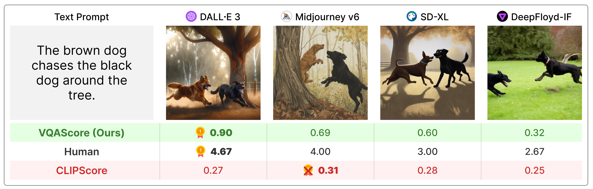

## **VQAScore for Evaluating Text-to-Visual Models [[Project Page]](https://linzhiqiu.github.io/papers/vqascore/)**  

*VQAScore allows researchers to automatically evaluate text-to-image/video/3D models using one-line of Python code!*

[[VQAScore Page](https://linzhiqiu.github.io/papers/vqascore/)] [[VQAScore Demo](https://huggingface.co/spaces/zhiqiulin/VQAScore)]  [[GenAI-Bench Page](https://linzhiqiu.github.io/papers/genai_bench/)] [[GenAI-Bench Demo](https://huggingface.co/spaces/BaiqiL/GenAI-Bench-DataViewer)] [[CLIP-FlanT5 Model Zoo](https://github.com/linzhiqiu/CLIP-FlanT5/blob/master/docs/MODEL_ZOO.md)]

**VQAScore: Evaluating Text-to-Visual Generation with Image-to-Text Generation** (ECCV 2024) [[Paper](https://arxiv.org/pdf/2404.01291)] [[HF](https://huggingface.co/zhiqiulin/clip-flant5-xxl)] <br>
[Zhiqiu Lin](https://linzhiqiu.github.io/), [Deepak Pathak](https://www.cs.cmu.edu/~dpathak/), Baiqi Li, Jiayao Li, [Xide Xia](https://scholar.google.com/citations?user=FHLTntIAAAAJ&hl=en), [Graham Neubig](https://www.phontron.com/), [Pengchuan Zhang](https://scholar.google.com/citations?user=3VZ_E64AAAAJ&hl=en), [Deva Ramanan](https://www.cs.cmu.edu/~deva/)

**GenAI-Bench: Evaluating and Improving Compositional Text-to-Visual Generation** (CVPR 2024, **Best Short Paper @ SynData Workshop**) [[Paper](https://arxiv.org/abs/2406.13743)] [[HF](https://huggingface.co/spaces/BaiqiL/GenAI-Bench-DataViewer)] <br>
Baiqi Li*, [Zhiqiu Lin*](https://linzhiqiu.github.io/), [Deepak Pathak](https://www.cs.cmu.edu/~dpathak/), Jiayao Li, Yixin Fei, Kewen Wu, Tiffany Ling, [Xide Xia*](https://scholar.google.com/citations?user=FHLTntIAAAAJ&hl=en), [Pengchuan Zhang*](https://scholar.google.com/citations?user=3VZ_E64AAAAJ&hl=en), [Graham Neubig*](https://www.phontron.com/), [Deva Ramanan*](https://www.cs.cmu.edu/~deva/) (*Co-First and co-senior authors)

## News

- [2024/08/13] 🔥 **VQAScore** is highlighted in Google's [Imagen3 report](https://arxiv.org/abs/2408.07009) as the strongest replacement of CLIPScore for automated evaluation! **GenAI-Bench** was chosen as one of the key benchmark to showcase Imagen3's superior prompt-image alignment. Kudos to Google for this achievement! [[Paper](https://arxiv.org/abs/2408.07009)]
- [2024/07/01] 🔥 **VQAScore** has been accepted to ECCV 2024!
- [2024/06/20] 🔥 **GenAI-Bench** won Best Short Paper at the CVPR'24 SynData Workshop! [[Workshop Site](https://syndata4cv.github.io/)].

 

VQAScore significantly outperforms previous metrics such as CLIPScore and PickScore on compositional text prompts, and it is much simpler than prior art (e.g., ImageReward, HPSv2, TIFA, Davidsonian, VPEval, VIEScore) making use of human feedback or proprietary models like ChatGPT and GPT-4Vision. 

## Quick start

Install the package via:
```bash
git clone https://github.com/linzhiqiu/t2v_metrics
cd t2v_metrics

conda create -n t2v python=3.10 -y
conda activate t2v
conda install pip -y

pip install torch torchvision torchaudio
pip install git+https://github.com/openai/CLIP.git
pip install -e . # local pip install
```

<!-- (not yet implemented) Or simply run `pip install t2v_metrics`.  -->
Or you can install via `pip install t2v-metrics`.

Now, the following Python code is all you need to compute the VQAScore for image-text alignment (higher scores indicate greater similarity):

```python
import t2v_metrics
clip_flant5_score = t2v_metrics.VQAScore(model='clip-flant5-xxl') # our recommended scoring model

### For a single (image, text) pair
image = "images/0.png" # an image path in string format
text = "someone talks on the phone angrily while another person sits happily"
score = clip_flant5_score(images=[image], texts=[text])

### Alternatively, if you want to calculate the pairwise similarity scores 
### between M images and N texts, run the following to return a M x N score tensor.
images = ["images/0.png", "images/1.png"]
texts = ["someone talks on the phone angrily while another person sits happily",
         "someone talks on the phone happily while another person sits angrily"]
scores = clip_flant5_score(images=images, texts=texts) # scores[i][j] is the score between image i and text j
```

### Notes on GPU and cache
- **GPU usage**: By default, this code uses the first cuda device on your machine. We recommend 40GB GPUs for the largest VQAScore models such as `clip-flant5-xxl` and `llava-v1.5-13b`. If you have limited GPU memory, consider smaller models such as `clip-flant5-xl` and `llava-v1.5-7b`.
- **Cache directory**: You can change the cache folder which saves all model checkpoints (default is `./hf_cache/`) by updating `HF_CACHE_DIR` in [t2v_metrics/constants.py](t2v_metrics/constants.py).

## **Advanced Usage**  

- [Batch processing for more image-text pairs](#batch-processing-for-more-image-text-pairs)
- [Check all supported models](#check-all-supported-models)
- [Customizing the question and answer template (for VQAScore)](#customizing-the-question-and-answer-template-for-vqascore)
- [Reproducing VQAScore paper results](#reproducing-vqascore-paper-results)
- [Reproducing GenAI-Bench paper results](#reproducing-genai-bench-paper-results)
- [Using GPT-4o for VQAScore](#using-gpt-4o-for-vqascore)
- [Implementing your own scoring metric](#implementing-your-own-scoring-metric)
- [Text generation (VQA) using CLIP-FlanT5](#text-generation-vqa-using-clip-flant5)

### Batch processing for more image-text pairs
With a large batch of M images x N texts, you can speed up using the ``batch_forward()`` function. 
```python
import t2v_metrics
clip_flant5_score = t2v_metrics.VQAScore(model='clip-flant5-xxl')

# The number of images and texts per dictionary must be consistent.
# E.g., the below example shows how to evaluate 4 generated images per text
dataset = [
  {'images': ["images/0/DALLE3.png", "images/0/Midjourney.jpg", "images/0/SDXL.jpg", "images/0/DeepFloyd.jpg"], 'texts': ["The brown dog chases the black dog around the tree."]},
  {'images': ["images/1/DALLE3.png", "images/1/Midjourney.jpg", "images/1/SDXL.jpg", "images/1/DeepFloyd.jpg"], 'texts': ["Two cats sit at the window, the blue one intently watching the rain, the red one curled up asleep."]},
  #...
]
scores = clip_flant5_score.batch_forward(dataset=dataset, batch_size=16) # (n_sample, 4, 1) tensor
```

### Check all supported models
We currently support running VQAScore with CLIP-FlanT5, LLaVA-1.5, and InstructBLIP. For ablation, we also include CLIPScore, BLIPv2Score, PickScore, HPSv2Score, and ImageReward:
```python
llava_score = t2v_metrics.VQAScore(model='llava-v1.5-13b')
instructblip_score = t2v_metrics.VQAScore(model='instructblip-flant5-xxl')
clip_score = t2v_metrics.CLIPScore(model='openai:ViT-L-14-336')
blip_itm_score = t2v_metrics.ITMScore(model='blip2-itm') 
pick_score = t2v_metrics.CLIPScore(model='pickscore-v1')
hpsv2_score = t2v_metrics.CLIPScore(model='hpsv2') 
image_reward_score = t2v_metrics.ITMScore(model='image-reward-v1') 
```
You can check all supported models by running the below commands:

```python
print("VQAScore models:")
t2v_metrics.list_all_vqascore_models()

print("ITMScore models:")
t2v_metrics.list_all_itmscore_models()

print("CLIPScore models:")
t2v_metrics.list_all_clipscore_models()
```

### Customizing the question and answer template (for VQAScore)
The question and answer slightly affect the final score, as shown in the Appendix of our paper. We provide a simple default template for each model and do not recommend changing it for the sake of reproducibility. However, we do want to point out that the question and answer can be easily modified. For example, CLIP-FlanT5 and LLaVA-1.5 use the following template, which can be found at [t2v_metrics/models/vqascore_models/clip_t5_model.py](t2v_metrics/models/vqascore_models/clip_t5_model.py):

```python
# {} will be replaced by the caption
default_question_template = 'Does this figure show "{}"? Please answer yes or no.'
default_answer_template = 'Yes'
```

You can customize the template by passing the `question_template` and `answer_template` parameters into the `forward()` or `batch_forward()` functions:

```python
# Use a different question for VQAScore
scores = clip_flant5_score(images=images,
                           texts=texts,
                           question_template='Is this figure showing "{}"? Please answer yes or no.',
                           answer_template='Yes')
```

You may also compute P(caption | image) ([VisualGPTScore](https://linzhiqiu.github.io/papers/visual_gpt_score)) instead of P(answer | image, question):
```python
scores = clip_flant5_score(images=images,
                           texts=texts,
                           question_template="", # no question
                           answer_template="{}") # this computes P(caption | image)
```

### Reproducing VQAScore paper results

Our [eval.py](eval.py) allows you to easily run 10 image/vision/3D alignment benchmarks (e.g., Winoground/TIFA160/SeeTrue/StanfordT23D/T2VScore):
```bash
python eval.py --model clip-flant5-xxl # for VQAScore
python eval.py --model openai:ViT-L-14 # for CLIPScore

# You can optionally specify question/answer template, for example:
python eval.py --model clip-flant5-xxl --question "Is the figure showing '{}'?" --answer "Yes"
```

### Reproducing GenAI-Bench paper results

Our [genai_image_eval.py](genai_image_eval.py) and [genai_video_eval.py](genai_video_eval.py) can reproduce the GenAI-Bench results. In additional [genai_image_ranking.py](genai_image_ranking.py) can reproduce the GenAI-Rank results:
```bash
# GenAI-Bench
python genai_image_eval.py --model clip-flant5-xxl
python genai_video_eval.py --model clip-flant5-xxl

# GenAI-Rank
python genai_image_ranking.py --model clip-flant5-xxl --gen_model DALLE_3
python genai_image_ranking.py --model clip-flant5-xxl --gen_model SDXL_Base
```

### Using GPT-4o for VQAScore!
We implemented VQAScore using GPT-4o to achieve a new state-of-the-art performance. Please see [t2v_metrics/gpt4_eval.py](t2v_metrics/gpt4_eval.py) for an example. Here is how to use it in command line:
```python
openai_key = # Your OpenAI key
score_func = t2v_metrics.get_score_model(model="gpt-4o", device="cuda", openai_key=openai_key, top_logprobs=20) # We find top_logprobs=20 to be sufficient for most (image, text) samples. Consider increase this number if you get errors (the API cost will not increase).
```

### Implementing your own scoring metric
You can easily implement your own scoring metric. For example, if you have a VQA model that you believe is more effective, you can incorporate it into the directory at [t2v_metrics/models/vqascore_models](t2v_metrics/models/vqascore_models/). For guidance, please refer to our example implementations of [LLaVA-1.5](t2v_metrics/models/vqascore_models/llava_model.py) and [InstructBLIP](t2v_metrics/models/vqascore_models/instructblip_model.py) as starting points.

### Text generation (VQA) using CLIP-FlanT5
To generate texts (captioning or VQA tasks) using CLIP-FlanT5, please use the below code:
```python
import t2v_metrics
clip_flant5_score = t2v_metrics.VQAScore(model='clip-flant5-xxl')

images = ["images/0.png", "images/0.png"] # A list of images
prompts = ["Please describe this image: ", "Does the image show 'someone talks on the phone angrily while another person sits happily'?"] # Corresponding prompts
clip_flant5_score.model.generate(images=images, prompts=prompts)
```

## Citation

If you find this repository useful for your research, please use the following (TO UPDATE with ArXiv ID).

```
@article{lin2024evaluating,
  title={Evaluating Text-to-Visual Generation with Image-to-Text Generation},
  author={Lin, Zhiqiu and Pathak, Deepak and Li, Baiqi and Li, Jiayao and Xia, Xide and Neubig, Graham and Zhang, Pengchuan and Ramanan, Deva},
  journal={arXiv preprint arXiv:2404.01291},
  year={2024}
}
```

## Acknowledgements
This repository is inspired from the [Perceptual Metric (LPIPS)](https://github.com/richzhang/PerceptualSimilarity) repository by Richard Zhang for automatic evaluation of image quality.
