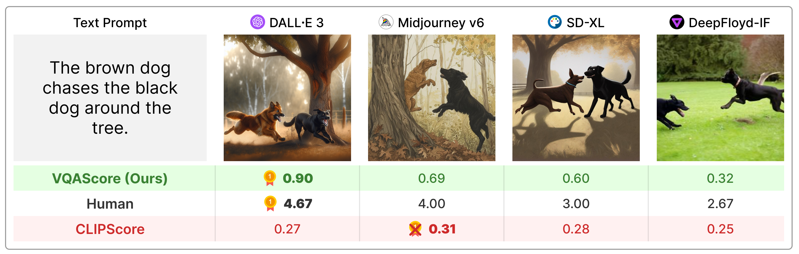

# VQAScore for Evaluating Text-to-Visual Models [[Project Page]](https://linzhiqiu.github.io/papers/vqascore/)

*VQAScore allows researchers to automatically evaluate text-to-image/video/3D models using one line of Python code!*

[[VQAScore Page](https://linzhiqiu.github.io/papers/vqascore/)] [[VQAScore Demo](https://huggingface.co/spaces/zhiqiulin/VQAScore)] [[GenAI-Bench Page](https://linzhiqiu.github.io/papers/genai_bench/)] [[GenAI-Bench Demo](https://huggingface.co/spaces/BaiqiL/GenAI-Bench-DataViewer)] [[CLIP-FlanT5 Model Zoo](https://github.com/linzhiqiu/CLIP-FlanT5/blob/master/docs/MODEL_ZOO.md)]

**VQAScore: Evaluating Text-to-Visual Generation with Image-to-Text Generation** (ECCV 2024) [[Paper](https://arxiv.org/pdf/2404.01291)] [[HF](https://huggingface.co/zhiqiulin/clip-flant5-xxl)]  
[Zhiqiu Lin](https://linzhiqiu.github.io/), [Deepak Pathak](https://www.cs.cmu.edu/~dpathak/), Baiqi Li, Jiayao Li, [Xide Xia](https://scholar.google.com/citations?user=FHLTntIAAAAJ&hl=en), [Graham Neubig](https://www.phontron.com/), [Pengchuan Zhang*](https://scholar.google.com/citations?user=3VZ_E64AAAAJ&hl=en), [Deva Ramanan*](https://www.cs.cmu.edu/~deva/) (*Co-First and co-senior authors)

**GenAI-Bench: Evaluating and Improving Compositional Text-to-Visual Generation** (CVPR 2024, **Best Short Paper @ SynData Workshop**) [[Paper](https://arxiv.org/abs/2406.13743)] [[HF](https://huggingface.co/spaces/BaiqiL/GenAI-Bench-DataViewer)]  
Baiqi Li*, [Zhiqiu Lin*](https://linzhiqiu.github.io/), [Deepak Pathak](https://www.cs.cmu.edu/~dpathak/), Jiayao Li, Yixin Fei, Kewen Wu, Tiffany Ling, [Xide Xia*](https://scholar.google.com/citations?user=FHLTntIAAAAJ&hl=en), [Pengchuan Zhang*](https://scholar.google.com/citations?user=3VZ_E64AAAAJ&hl=en), [Graham Neubig*](https://www.phontron.com/), [Deva Ramanan*](https://www.cs.cmu.edu/~deva/) (*Co-First and co-senior authors)

**CameraBench: Towards Understanding Camera Motions in Any Video** (arXiv 2025) [[Paper](https://arxiv.org/abs/2504.15376)] [[Site](https://linzhiqiu.github.io/papers/camerabench/)]  
[Zhiqiu Lin\*](https://linzhiqiu.github.io/), Siyuan Cen\*, Daniel Jiang, Jay Karhade, Hewei Wang, [Chancharik Mitra](https://chancharikmitra.github.io/), Tiffany Yu Tong Ling, Yuhan Huang, Sifan Liu, Mingyu Chen, Rushikesh Zawar, Xue Bai, Yilun Du, Chuang Gan, [Deva Ramanan](https://www.cs.cmu.edu/~deva/) (\*Co-First Authors)

**CHAI: Building a Precise Video Language with Human–AI Oversight** (CVPR 2026, **Highlight · Top 3%**) [[Paper](https://arxiv.org/abs/2604.21718)] [[Code](https://github.com/chancharikmitra/CHAI)] [[HF](https://huggingface.co/datasets/chancharikm/CHAI_testset)] [[Site](https://linzhiqiu.github.io/papers/chai/)]  
[Zhiqiu Lin](https://linzhiqiu.github.io/)\*, [Chancharik Mitra](https://chancharikmitra.github.io/)\*, Siyuan Cen, Isaac Li, Yuhan Huang, Yu Tong Tiffany Ling, Hewei Wang, Irene Pi, Shihang Zhu, Ryan Rao, George Liu, Jiaxi Li, Ruojin Li, Yili Han, [Yilun Du](https://yilundu.github.io/), [Deva Ramanan](https://www.cs.cmu.edu/~deva/) (\*Co-First Authors)

---

## ⚠️ Reproducing Paper Results (Legacy Version)

> **If you need to reproduce results from the original VQAScore or GenAI-Bench papers**, please use the legacy v3.0 release, which includes CLIP-FlanT5, InstructBLIP, LLaVA-1.5, and other models used in those works.
>
> See [`V_3.0_README.md`](V_3.0_README.md) for full documentation, or install the legacy version directly:
> ```bash
> pip install t2v-metrics==3.0
> ```
> v3.1 targets `torch>=2.7.0` and `transformers>=5.0.0` to support the latest
> frontier models. Models using `trust_remote_code` (InternVL, Molmo2) are temporarily
> unavailable due to transformers 5.x breaking changes and will return in a future release.
---

## News

- [2026/06/04] 🚀 **VQAScore v3.1** — major model refresh with support for **Gemma 3**, **Qwen3.5**, and updated **Qwen3-VL** and **Qwen3-Omni** families. Adds `forward_with_trace` for full token-level scoring transparency on open-source Qwen models. Legacy models (CLIP-FlanT5, LLaVA-1.5, InstructBLIP, etc.) are preserved in [v3.0](V_3.0_README.md) for paper reproducibility.
- [2025/10/01] 🚀 **VQAScore** now supports **Qwen3-VL** and **Qwen3-Omni** models! Qwen3-Omni-30B adds groundbreaking **multimodal capabilities** including audio processing, making it the first audio-enabled model in the VQAScore framework.
- [2025/09/03] 🚀 **VQAScore** gets a **major upgrade** with support for **20+ state-of-the-art video-language models** and full integration of [CameraBench](https://linzhiqiu.github.io/papers/camerabench/). Huge thanks to **Chancharik Mitra** for leading this milestone update!
- [2025/09/03] ✨ **VQAScore** has become the **go-to evaluation choice for generative models**: **GenAI-Bench** is now adopted by **Google DeepMind** (Imagen3 & Imagen4), **Bytedance Seed**, **NVIDIA**, and others. Our open-source CLIP-FlanT5 models have been downloaded over **2 million times** on Hugging Face!
- [2024/08/13] 🔥 **VQAScore** is highlighted in Google's [Imagen3 report](https://arxiv.org/abs/2408.07009) as the strongest replacement of CLIPScore for automated evaluation!
- [2024/07/01] 🔥 **VQAScore** accepted to ECCV 2024!
- [2024/06/20] 🔥 **GenAI-Bench** won Best Short Paper at the CVPR'24 SynData Workshop!



---

## Available Models (v3.1)

### VQAScore

| Model Family | Image | Video | Audio | Models |
|---|:---:|:---:|:---:|---|
| GPT-4 | ✅ | ✅ | | `gpt-4o`, `gpt-4.1` |
| Gemini †| ✅ | ✅ | | `gemini-2.5-flash`, `gemini-2.5-pro` |
| Gemma 3 | ✅ | ✅ | | `gemma-3-4b-it`, `gemma-3-12b-it`, `gemma-3-27b-it` |
| PaliGemma ‡ | ✅ | | | `paligemma-3b-mix-224`, `paligemma-3b-mix-448`, `paligemma-3b-mix-896` |
| Qwen2.5-VL ★ | ✅ | ✅ | | `qwen2.5-vl-3b`, `qwen2.5-vl-7b`, `qwen2.5-vl-32b`, `qwen2.5-vl-72b` |
| Qwen3-VL ★ | ✅ | ✅ | | `qwen3-vl-2b`, `qwen3-vl-2b-thinking`, `qwen3-vl-4b`, `qwen3-vl-4b-thinking`, `qwen3-vl-8b`, `qwen3-vl-8b-thinking`, `qwen3-vl-30b-a3b`, `qwen3-vl-30b-a3b-thinking`, `qwen3-vl-32b`, `qwen3-vl-32b-thinking`, `qwen3-vl-235b-a22b`, `qwen3-vl-235b-a22b-thinking` |
| Qwen3.5 ★ | ✅ | ✅ | | `qwen3.5-4b`, `qwen3.5-9b`, `qwen3.5-27b` |
| Qwen3-Omni ★ | ✅ | ✅ | ✅ | `qwen3-omni-30b-a3b`, `qwen3-omni-30b-a3b-captioner`, `qwen3-omni-30b-a3b-thinking` |

> **†** Gemini VQAScore requires a **Vertex AI project** (`project_id`). The standard Gemini Developer API key does not support logprobs and cannot be used for scoring. See [Gemini Usage](#gemini-vqascore-vertex-ai-required).
>
> **‡** PaliGemma is **image-only**. Video inputs are not supported.
>
> **★** Supports [`forward_with_trace`](#token-level-scoring-transparency-forward_with_trace) for full token-level scoring transparency.

---

## Quick Start

```bash
git clone https://github.com/linzhiqiu/t2v_metrics
cd t2v_metrics

conda create -n t2v python=3.10 -y
conda activate t2v
conda install pip -y
conda install ffmpeg -c conda-forge

pip install -e .
```

Or via pip:
```bash
pip install t2v-metrics
```

## Flash Attention (Optional)

By default, all models use PyTorch's built-in **SDPA** (`scaled_dot_product_attention`), 
which works out of the box on any system with no extra installation.

For better performance on compatible hardware, you can optionally enable Flash Attention 2:

```bash
pip install flash-attn --no-build-isolation
```

> ⚠️ This requires ~20–30 minutes to compile and must match your CUDA + PyTorch version.
> Pre-built wheels may be available at:
> https://github.com/Dao-AILab/flash-attention/releases

Once installed, pass `attn_implementation='flash_attention_2'` when loading any model:

```python
scorer = t2v_metrics.VQAScore(model='qwen3-vl-8b', attn_implementation='flash_attention_2')
```

<!-- For InternVL models, use `use_flash_attn=True` instead:

```python
scorer = t2v_metrics.VQAScore(model='internvl3.5-8b', use_flash_attn=True)
``` -->

> **Note:** Flash Attention requires GLIBC ≥ 2.32. If you are on an older Linux 
> distribution, SDPA is the recommended option.
---

## Basic Usage

```python
import t2v_metrics

# Image scoring
qwen_score = t2v_metrics.VQAScore(model='qwen2.5-vl-7b')

image = "images/0.png"
text  = "someone talks on the phone angrily while another person sits happily"
score = qwen_score(images=[image], texts=[text])

# Pairwise M images x N texts → (M, N) score tensor
images = ["images/0.png", "images/1.png"]
texts  = ["someone talks on the phone angrily", "someone talks on the phone happily"]
scores = qwen_score(images=images, texts=texts)
```

---

## Video-Text Scoring

```python
import t2v_metrics

qwen_score = t2v_metrics.VQAScore(model='qwen2.5-vl-7b')

video = "videos/baby.mp4"
text  = "a baby crying"
score = qwen_score(images=[video], texts=[text])

# Pairwise M videos x N texts:
videos = ["videos/baby.mp4", "videos/ducks.mp4"]
texts  = ["a baby crying", "a group of ducks standing in the water"]
scores = qwen_score(images=videos, texts=texts, fps=8.0)  # M x N score tensor

# Dynamic FPS (Qwen models only):
score = qwen_score(images=[video], texts=[text], fps="dynamic")
```

---

## Model-Specific Usage

### GPT-4o / GPT-4.1

```python
import t2v_metrics

# API key via argument or OPENAI_API_KEY environment variable
gpt_score = t2v_metrics.VQAScore(model='gpt-4o')
# or: gpt_score = t2v_metrics.VQAScore(model='gpt-4o', api_key="YOUR_KEY")

score = gpt_score(images=["images/0.png"], texts=["a dog"])

# Note: GPT-5 and above (gpt-5, gpt-5.4, gpt-5.5, etc.) are NOT supported
# for VQAScore — they are reasoning models and do not expose logprobs.
```

### Gemini VQAScore (Vertex AI required)

> **Important:** Gemini VQAScore requires a **Google Cloud Vertex AI project**. The standard Gemini Developer API key path does not support logprobs and will raise an error if used for scoring. The `generate()` method works with either backend.

```python
import t2v_metrics

# Vertex AI — project_id via argument or GOOGLE_CLOUD_PROJECT env var
# Authentication via ADC: run `gcloud auth application-default login` once
gemini_score = t2v_metrics.VQAScore(model='gemini-2.5-pro', project_id='your-gcp-project-id')
# or: set GOOGLE_CLOUD_PROJECT and GOOGLE_CLOUD_LOCATION=global, then:
# gemini_score = t2v_metrics.VQAScore(model='gemini-2.5-pro')

video = "videos/baby.mp4"
text  = "a baby crying"
score = gemini_score(images=[video], texts=[text])

# Pairwise:
videos = ["videos/baby.mp4", "videos/ducks.mp4"]
texts  = ["a baby crying", "a group of ducks standing in the water"]
scores = gemini_score(images=videos, texts=texts)

# Generation (works with either Vertex AI or API key):
responses = gemini_score.model.generate(
    images=[video],
    texts=["Describe what is happening in this video."]
)
print(responses[0])
```

<!-- ### InternVL3 / InternVL3.5

```python
import t2v_metrics

internvl_score = t2v_metrics.VQAScore(model='internvl3.5-8b')

score = internvl_score(images=["images/0.png"], texts=["a dog"])
score = internvl_score(images=["videos/baby.mp4"], texts=["a baby crying"])
``` -->

### Gemma 3

```python
import t2v_metrics

# Video is supported via uniform frame sampling with interleaved timestamps
gemma_score = t2v_metrics.VQAScore(model='gemma-3-12b-it')

score = gemma_score(images=["images/0.png"], texts=["a dog"])
score = gemma_score(images=["videos/baby.mp4"], texts=["a baby crying"], num_frames=10)
```

### PaliGemma (image-only)

```python
import t2v_metrics

# PaliGemma supports images only — video inputs will raise NotImplementedError
pali_score = t2v_metrics.VQAScore(model='paligemma-3b-mix-448')

score = pali_score(images=["images/0.png"], texts=["a dog"])
```
<!-- 
### Molmo2

```python
import t2v_metrics

# Molmo2 supports native video — no frame extraction needed
molmo_score = t2v_metrics.VQAScore(model='molmo2-8b')

score = molmo_score(images=["images/0.png"], texts=["a dog"])
score = molmo_score(images=["videos/baby.mp4"], texts=["a baby crying"])
``` -->

### Qwen3-Omni (Audio-Visual-Text)

```python
import t2v_metrics

qwen3omni_score = t2v_metrics.VQAScore(model='qwen3-omni-30b-a3b')

# Image + text
score = qwen3omni_score(images=["images/0.png"], texts=["a dog"])

# Video + text
score = qwen3omni_score(images=["videos/baby.mp4"], texts=["a baby crying"])

# Image + audio + text alignment
score = qwen3omni_score(
    images=["images/concert.png"],
    texts=["a concert with enthusiastic audience"],
    audio_paths=["audio/applause.wav"]
)

# Generation with audio output
response, audio = qwen3omni_score.model.generate(
    images=["images/concert.png"],
    texts=["What can you see and hear?"],
    audio_paths=["audio/applause.wav"],
    return_audio=True,
    speaker="Ethan"
)
```

---

## Token-Level Scoring Transparency (`forward_with_trace`)

For supported open-source Qwen models, `forward_with_trace` returns a full trace of the scoring process including per-token probabilities and top alternatives. This is useful for debugging and understanding why a model assigns a particular score.

**Supported models:** Qwen2.5-VL, Qwen3-VL, Qwen3.5, Qwen3-Omni

```python
import t2v_metrics

# Qwen2.5-VL
scorer = t2v_metrics.VQAScore(model='qwen2.5-vl-7b')
scores, traces = scorer.model.forward_with_trace(
    images=["images/0.png"],
    texts=["a dog"],
    score_position="end",  # "start" or "end"
    debug=True             # prints token-level details to stdout
)
print(f"Score: {scores[0]:.4f}")
print(f"Scored token: {traces[0]['scored_tokens_text']!r}")
print(f"Top alternatives: {traces[0]['token_details'][0]['top_alternatives'][:3]}")

# Qwen3-VL
scorer = t2v_metrics.VQAScore(model='qwen3-vl-8b')
scores, traces = scorer.model.forward_with_trace(
    images=["videos/baby.mp4"],
    texts=["a baby crying"],
    debug=True
)

# Qwen3.5 — same interface, thinking mode disabled automatically for VQAScore
scorer = t2v_metrics.VQAScore(model='qwen3.5-9b')
scores, traces = scorer.model.forward_with_trace(
    images=["images/0.png"],
    texts=["a dog"],
    debug=True
)

# Qwen3-Omni — also supports audio_paths
scorer = t2v_metrics.VQAScore(model='qwen3-omni-30b-a3b')
scores, traces = scorer.model.forward_with_trace(
    images=["videos/baby.mp4"],
    texts=["a baby crying"],
    score_position="end",
    debug=True
)
```

The `trace` dictionary for each sample contains:

```python
{
    'generated_text':     str,         # full decoded output
    'generated_length':   int,         # number of generated tokens
    'score_position':     str,         # "start" or "end"
    'score_start_idx':    int,         # index in the score sequence
    'scored_indices':     List[int],   # token indices that were scored
    'scored_tokens_text': str,         # decoded text of scored tokens
    'probability':        float,       # geometric mean probability (the VQAScore)
    'token_details': [
        {
            'position':            int,
            'expected_token_id':   int,
            'expected_token_text': str,
            'probability':         float,
            'top_alternatives': [
                {'token_id': int, 'token_text': str, 'probability': float},
                ...  # top 5
            ]
        },
        ...
    ]
}
```

---

## Customizing the Question and Answer Template

```python
import t2v_metrics

scorer = t2v_metrics.VQAScore(model='qwen2.5-vl-7b')

# Custom question template
scores = scorer(
    images=["images/0.png"],
    texts=["a dog"],
    question_template='Is this figure showing "{}"? Please answer yes or no.',
    answer_template='Yes'
)

# Compute P(caption | image) — VisualGPTScore style
scores = scorer(
    images=["images/0.png"],
    texts=["a dog"],
    question_template="",   # no question
    answer_template="{}"    # computes P(caption | image)
)
```

---

## Batch Processing

```python
import t2v_metrics

scorer = t2v_metrics.VQAScore(model='qwen2.5-vl-7b')

dataset = [
    {'images': ["images/0/DALLE3.png", "images/0/Midjourney.jpg"], 'texts': ["The brown dog chases the black dog."]},
    {'images': ["images/1/DALLE3.png", "images/1/Midjourney.jpg"], 'texts': ["Two cats sit at the window."]},
]
scores = scorer.batch_forward(dataset=dataset, batch_size=16)  # (n_sample, 2, 1) tensor
```

---

## Text Generation

```python
import t2v_metrics

scorer = t2v_metrics.VQAScore(model='qwen2.5-vl-7b')

responses = scorer.model.generate(
    images=["images/0.png", "videos/baby.mp4"],
    texts=["Describe this image.", "What is happening in this video?"]
)
print(responses[0])
print(responses[1])
```

---

## Benchmarking on GenAI-Bench

```bash
# Generate images
python -m genai_bench.generate --output_dir ./outputs/ --gen_model runwayml/stable-diffusion-v1-5

# Evaluate with VQAScore
python -m genai_bench.evaluate --model qwen2.5-vl-7b --output_dir ./outputs --gen_model runwayml/stable-diffusion-v1-5

# Or with GPT-4o
python -m genai_bench.evaluate --model gpt-4o --output_dir ./outputs --gen_model runwayml/stable-diffusion-v1-5
```

---

## Notes on GPU and Cache

- **GPU**: Most models require 40GB+ GPUs. For limited VRAM, use smaller variants (e.g., `qwen3-vl-2b`).
- **Cache**: Change the default cache directory (`./hf_cache/`) by updating `HF_CACHE_DIR` in `t2v_metrics/constants.py`.
- **Gemini**: Newer Gemini 3.x models (e.g., `gemini-3.1-pro-preview`) are only available on the `global` Vertex AI endpoint. Set `GOOGLE_CLOUD_LOCATION=global`.

---

## Contributions

- **[Zhiqiu Lin](https://x.com/ZhiqiuLin)**, **[Jean de Nyandwi](https://x.com/Jeande_d)**, **[Chancharik Mitra](https://chancharikmitra.github.io/)**  
  Implemented image-based CLIPScore and VQAScore for: CLIP-FlanT5, GPT-4o, LLaVA-1.5, InstructBLIP, OpenCLIP, HPSv2, PickScore.

- **Baiqi Li**  
  Implemented GenAI-Bench and GenAI-Rank benchmarks.

- **[Chancharik Mitra](https://x.com/chancharikm)**  
  Implemented CameraBench and video-based VQAScore for: LLaVA-OneVision, Qwen2.5-VL, InternVideo2, InternVL2, InternLMXC2.5, Gemma 3, Qwen3-VL, Qwen3.5, Qwen3-Omni, Gemini (Vertex AI), and the v3.1 codebase modernization.

---

## Citation

```bibtex
@article{lin2024evaluating,
  title   = {Evaluating Text-to-Visual Generation with Image-to-Text Generation},
  author  = {Lin, Zhiqiu and Pathak, Deepak and Li, Baiqi and Li, Jiayao and Xia, Xide and Neubig, Graham and Zhang, Pengchuan and Ramanan, Deva},
  journal = {arXiv preprint arXiv:2404.01291},
  year    = {2024}
}

@article{li2024genaibench,
  title   = {GenAI-Bench: Evaluating and Improving Compositional Text-to-Visual Generation},
  author  = {Li, Baiqi and Lin, Zhiqiu and Pathak, Deepak and Li, Jiayao and Fei, Yixin and Wu, Kewen and Ling, Tiffany and Xia, Xide and Zhang, Pengchuan and Neubig, Graham and Ramanan, Deva},
  journal = {arXiv preprint arXiv:2406.13743},
  year    = {2024}
}

@article{camerabench,
  title   = {Towards Understanding Camera Motions in Any Video},
  author  = {Lin, Zhiqiu and Cen, Siyuan and Jiang, Daniel and Karhade, Jay and Wang, Hewei and Mitra, Chancharik and Ling, Yu Tong Tiffany and Huang, Yuhan and Liu, Sifan and Chen, Mingyu and Zawar, Rushikesh and Bai, Xue and Du, Yilun and Gan, Chuang and Ramanan, Deva},
  journal = {arXiv preprint arXiv:2504.15376},
  year    = {2025}
}

@inproceedings{lin2026chai,
  title={Building a Precise Video Language with Human-AI Oversight},
  author={Zhiqiu Lin and Chancharik Mitra and Siyuan Cen and Isaac Li
          and Yuhan Huang and Yu Tong Tiffany Ling and Hewei Wang
          and Irene Pi and Shihang Zhu and Ryan Rao and George Liu
          and Jiaxi Li and Ruojin Li and Yili Han and Yilun Du
          and Deva Ramanan},
  booktitle={IEEE/CVF Conference on Computer Vision and Pattern Recognition (CVPR)},
  year={2026}
}
```

---

## Acknowledgements

This repository is inspired by the [Perceptual Metric (LPIPS)](https://github.com/richzhang/PerceptualSimilarity) repository by Richard Zhang.
