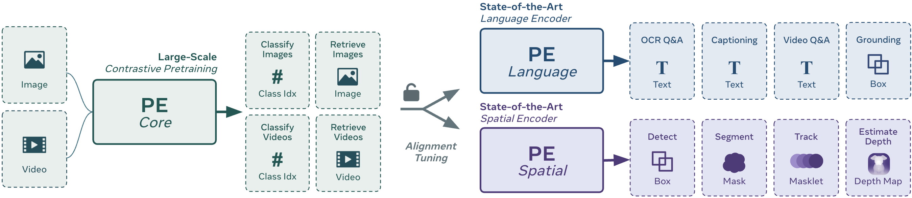
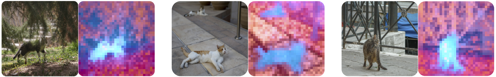
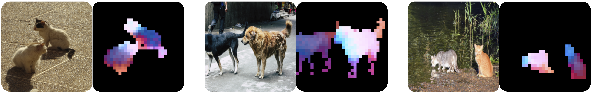

# Perception Encoder (PE)

[](https://ai.meta.com/research/publications/perception-encoder-the-best-visual-embeddings-are-not-at-the-output-of-the-network) 
[](https://arxiv.org/abs/2504.13181)
[](https://huggingface.co/collections/facebook/perception-encoder-67f977c9a65ca5895a7f6ba1)
[](https://colab.research.google.com/github/facebookresearch/perception_models/blob/main/apps/pe/docs/pe_demo.ipynb)
[](https://opensource.org/licenses/Apache-2.0)

This is the official implementation of **Perception Encoder** from our paper:  
**[Perception Encoder: The best visual embeddings are hidden inside the network](https://ai.meta.com/research/publications/perception-encoder-the-best-visual-embeddings-are-not-at-the-output-of-the-network)**  
Daniel Bolya*, Po-Yao Huang*, Peize Sun*, Jang Hyun Cho*, Andrea Madotto*, Chen Wei, Tengyu Ma, Jiale Zhi, Jathushan Rajasegaran, Hanoona Rasheed, Junke Wang, Marco Monteiro, Hu Xu, Shiyu Dong, Nikhila Ravi, Daniel Li, Piotr Dollár, Christoph Feichtenhofer  
\* Joint First Author  
_[HuggingFace](https://huggingface.co/collections/facebook/perception-encoder-67f977c9a65ca5895a7f6ba1)_ | _[Blog](https://ai.meta.com/blog/meta-fair-updates-perception-localization-reasoning)_ | _[GitHub](https://github.com/facebookresearch/perception_models)_ | _[arXiv](https://arxiv.org/abs/2504.13181)_ | _[BibTeX](#citation)_


<br />

Perception Encoder (PE) is a family of models that exhibits state-of-the-art performance on a large variety of vision tasks. By using a robust contrastive pretraining recipe and finetuning on synthetically aligned videos, PE not only outperforms all existing models on classification and retrieval, but it also internally produces strong, general features that scale for downstream tasks. PE unlocks the ability for large-scale contrastive pretraining to transfer to downstream tasks with alignment tuning to capitalize on those general features.

The result is an extremely powerful family of checkpoints: PE core can outperform SigLIP2 on Image CLIP and InternVideo2 on Video CLIP; PE lang can be used to outperform QwenVL2.5 and InternVL3 on multimodal language modeling; and PE spatial can outperform DINOv2 on dense prediction tasks—all following the same, easily scalable contrastive pretraining.


### Contents
PE has 3 types of checkpoints, each excelling in a different area of computer vision:
 - [PE core](#perception-encoder-core): a state-of-the-art CLIP model for zero-shot image and video classification as well as image and video retrieval.
 - [PE lang](#perception-encoder-language): a state-of-the-art large language model aligned vision encoder that enables our open-data [Perception Language Model (PLM)](../plm/README.md) to compete at the forefront of the field.
 - [PE spatial](#perception-encoder-spatial): a state-of-the-art spatially tuned model that can outperform the best spatial models for dense prediction tasks like detection, depth estimation, and tracking.

Finally, we also release a dataset we collected in the process of creating our novel video data engine:
 - [PE Video Dataset (PVD)](#pe-video-dataset-pvd): an diverse set of 1M high quality datasets with accompanying metadata as well as 120K human-refined detailed video captions.

If you want to get started right away check out the [usage](#usage) section!

:construction: This repository is under construction! :construction:


## Perception Encoder: Core
PE core is our base model trained with our robust image pretraining schedule and finetuned on the data generated by our synthetic video data engine.

#### Model Configurations
PE core curently comes in 3 sizes. PE core G is the main checkpoint, with L and B models distilled from it.

| Scale | Tower  | Params | Width | Depth | MLP  | Heads | CLIP Dim |  Resolution / Context Len |
|:-----:|:------:|:------:|:-----:|:-----:|:----:|:-----:|:--------:|:-------------------------:|
| **B/16** | Vision | 0.09B  | 768   | 12    | 3072 | 12    | 1024  | 224px                     |
|       | Text   | 0.31B  | 1024  | 24    | 4096 | 16    | 1024     | 32 tokens                 |
| **L/14** | Vision | 0.32B  | 1024  | 24    | 4096 | 16    | 1024  | 336px                     |
|       | Text   | 0.31B  | 1024  | 24    | 4096 | 16    | 1024     | 32 tokens                 |
| **G/14** | Vision | 1.88B  | 1536  | 50    | 8960 | 16    | 1280  | 448px                     |
|       | Text   | 0.47B  | 1280  | 24    | 5120 | 20    | 1280     | 72 tokens                 |

All PE core models use an attention pooling block with 8 heads on top of the vision tower. The L and B models _additionally_ have a class token for global aggregation. See the paper for more details.


#### Model Performance
PE core obtains extremely strong results across the board on zero-shot image classification and retrieval _as well as_ zero-shot video classification and retrieval. We present a sample of its performance across those domains below.

| Model | Checkpoint | IN-1k | IN-v2 | IN-A | ObjectNet | COCO-T2I | Kinetics-400 | VTT-T2I
|:---:|:---:|:---:|:---:|:---:|:---:|:---:|:---:|:---:|
| **B/16** 224px | [PE-Core-B16-224](https://huggingface.co/facebook/PE-Core-B16-224) | 78.4 | 71.7 | 62.4 |  71.9 | 50.9 | 65.6 | 47.6 |
| **L/14** 336px | [PE-Core-L14-336](https://huggingface.co/facebook/PE-Core-L14-336) | 83.5 | 77.9 | 89.0 | 84.7 | 57.1 | 73.4 | 50.3  |
| **G/14** 448px | [PE-Core-G14-448](https://huggingface.co/facebook/PE-Core-G14-448) | 85.4 | 80.2 | 92.6 | 88.2 | 58.1 | 76.9 | 51.2  |

PE core performs particularly well on the _hard_ benchmarks such as ObjectNet and ImageNet-A.


## Perception Encoder: Language
PE lang takes the strong language performance from the intermediate layers of PE core and aligns it to the end for use with large language models. We specifically tuned PE lang to be versatile for any multimodal langugage modeling use case, including using different language model decoders (e.g., Llama / Qwen) and using different eval settings (e.g., native res / tiling). PE lang performs particularly well on OCR and document tasks.

We release two PE Lang checkpoints. Here are their results benchmarked in the frozen encoder [PLM-8B](../plm/README.md) benchmark SFT using 448px _only_ (i.e., _with no tiling_) and Llama 3.1 8B as the decoder:

| Encoder | Checkpoint | Doc VQA (val) | InfoQA (val) | TextVQA | MVBench | PerceptionTest (val) | EgoSchema (val) |
|:---:|:---:|:---:|:---:|:---:|:---:|:---:|:---:|
| **L/14** 448px | [PE-Lang-L14-448](https://huggingface.co/facebook/PE-Lang-L14-448) | 81.9 | 46.4 | 73.0 | 52.3 | 54.7 | 59.8 |
| **G/14** 448px | [PE-Lang-G14-448](https://huggingface.co/facebook/PE-Lang-G14-448) | 84.4 | 48.3 | 75.2 | 52.4 | 56.0 | 62.0 |


Here is a sample of the performance obtainable by using PE lang G tuned further with [PLM-8B](../plm/README.md) using 36+1 image tiles / 32 video frames and Llama 3.1 8B as the decoder:

| Model | Encoder | Doc VQA (test) | InfoQA (test) | TextVQA | MVBench | PerceptionTest (test) | EgoSchema (test) |
|:---:|:---:|:---:|:---:|:---:|:---:|:---:|:---:|
| PLM-8B | [PE-Lang-G14-448](https://huggingface.co/facebook/PE-Core-G14-448)* | 94.6 | 80.9 | 86.5 | 77.1 | 82.7 | 68.8 | 

\* This checkpoint was further aligned using tiling. We will release the tiling aligned checkpoint soon.

See the paper for full performance evaluations and fair comparisons to other models. 


## Perception Encoder: Spatial
PE spatial similarly takes the strong spatial performance from the intermediate layers of PE core and aligns it to the end using a simple frozen teacher self-distillation loss and further refines with a novel SAM 2.1 mask-based learning strategy. PE spatial performs well on dense prediction tasks such as detection.

And despite being a short finetuning step using PE core's intermediate layers as a teacher (a pure CLIP model with a global loss) plus a little bit of refinement with SAM, the resulting feature space is quite detailed and well-aligned. Here we picture the PCA of the last layer features mapped to LCh color space (see the paper for more details):



PE spatial also has nuanced semantic correspondences between objects thanks to its CLIP pretraining. Here we show again PCA but only for the tokens not masked. PE spatial shows correspondence between parts like the first image cats' heads, backs, and legs. Additionally, PE spatial can show more nuanced correspondences like for the last two images, where the red/blue directions still denote parts, but the lightness/darkness directions now indicate semantics (i.e., dog/cat breed):  



We release one checkpoint for PE spatial so far:  
| Encoder | Checkpoint | ADE20k <br/> Linear Probe <br/> 448px w/o TTA | LVIS <br /> Mask R-CNN 1024px <br /> Box / Mask mAP | COCO <br/> DETA 1824px <br /> Box mAP |
|:---:|:---:|:---:|:---:|:---:|
| **G/14** 448px | [PE-Spatial-G14-448](https://huggingface.co/facebook/PE-Spatial-G14-448) | 49.3 | 54.2 / 49.3 | 66.0

See paper for full set of evaluations and fair comparison to other works.

## PE Video Dataset (PVD)
In the process of developing the video data engine we use for PE core, we have collected a high-quality video dataset that contains 1M diverse videos with high visual fidelity and large resolution, split into 10 high level categories. We also annotated 120K samples with the highest amount of motiotion with our video captioning data engine and further asked human annotators to refine the captions. You can find more information about and download PVD [here](https://ai.meta.com/datasets/pe-video/).


# Usage

## Installation
See the installation instructions for `perception_models` in the parent repository: https://github.com/facebookresearch/perception_models.git

Then download a model using one of the above checkpoint links.

## Examples
Here are some examples about how to use the models. More coming soon!

### 1. PE core CLIP Image / Text Feature Extraction 
Perception Encoder follows the same structure as [open_clip](https://github.com/mlfoundations/open_clip). You can use the following example for image and language feature extraction.

```python
import torch
from PIL import Image
import core.vision_encoder.pe as pe
import core.vision_encoder.transforms as transforms

print("CLIP configs:", pe.CLIP.available_configs())
# CLIP configs: ['PE-Core-G14-448', 'PE-Core-L14-336', 'PE-Core-B16-224']

model = pe.CLIP.from_config("PE-Core-L14-336", pretrained=True)  # Downloads from HF
model = model.cuda()

preprocess = transforms.get_image_transform(model.image_size)
tokenizer = transforms.get_text_tokenizer(model.context_length)

image = preprocess(Image.open("docs/assets/cat.png")).unsqueeze(0).cuda()
text = tokenizer(["a diagram", "a dog", "a cat"]).cuda()

with torch.no_grad(), torch.autocast("cuda"):
    image_features, text_features, logit_scale = model(image, text)
    text_probs = (logit_scale * image_features @ text_features.T).softmax(dim=-1)

print("Label probs:", text_probs)  # prints: [[0.0, 0.0, 1.0]]
```
For a in-depth demo for image and video feature extraction, please refer to our [demo notebook](docs/pe_demo.ipynb).


### 2. Clipbench Evaluation
Please refer to [`docs/evaluation.md`](docs/evaluation.md) for the following benchmarks:
- zero-shot image classifcation
- zero-shot image retrieval
- zero-shot video classifcation
- zero-shot video retrieval


### 3. Loading PE core / PE lang / PE spatial Vision Encoder Checkpoints
Loading the vision encoders for PE core, PE lang, and PE spatial for downstream use is similar to the CLIP checkpoints, just using `VisionTransformer` instead. Here you can additionally load PE lang and PE spatial for downstream feature encoding.
```python
import torch
from PIL import Image
import core.vision_encoder.pe as pe
import core.vision_encoder.transforms as transforms

print("PE configs:", pe.VisionTransformer.available_configs())
# PE configs: ['PE-Core-G14-448', 'PE-Core-L14-336', 'PE-Core-B16-224', 'PE-Lang-G14-448', 'PE-Lang-L14-448', 'PE-Spatial-G14-448']

model = pe.VisionTransformer.from_config("PE-Lang-L14-448", pretrained=True)  # Loads from HF
model = model.cuda()

preprocess = transforms.get_image_transform(model.image_size)
image = preprocess(Image.open("docs/assets/cat.png")).unsqueeze(0).cuda()

out = model.forward_features(image)  # pass layer_idx=<idx> to get a specific layer's output!
print(out.shape)
# torch.Size([1, 1025, 1024])
```

## Acknowledgement 🙏
We are thankful to [Open_CLIP](https://github.com/mlfoundations/open_clip) for open-source contributions in CLIP training, and [CLIP_benchmark](https://github.com/LAION-AI/CLIP_benchmark) for CLIP model inference and evaluation. The PE code structure and implementation follow Open_CLIP, and this evaluation is based on CLIP_benchmark. 


## License
All checkpoints released on this page, unless otherwise specified, are released with the [Apache 2.0 license](https://opensource.org/license/apache-2-0). The code itself is licensed under the parent license of this repository.

## Citation
```BibTeX
@article{bolya2025PerceptionEncoder,
  title={Perception Encoder: The best visual embeddings are not at the output of the network},
  author={Daniel Bolya and Po-Yao Huang and Peize Sun and Jang Hyun Cho and Andrea Madotto and Chen Wei and Tengyu Ma and Jiale Zhi and Jathushan Rajasegaran and Hanoona Rasheed and Junke Wang and Marco Monteiro and Hu Xu and Shiyu Dong and Nikhila Ravi and Daniel Li and Piotr Doll{\'a}r and Christoph Feichtenhofer},
  journal={arXiv:2504.13181},
  year={2025}
}

@article{cho2025PerceptionLM,
  title={PerceptionLM: Open-Access Data and Models for Detailed Visual Understanding},
  author={Jang Hyun Cho and Andrea Madotto and Effrosyni Mavroudi and Triantafyllos Afouras and Tushar Nagarajan and Muhammad Maaz and Yale Song and Tengyu Ma and Shuming Hu and Hanoona Rasheed and Peize Sun and Po-Yao Huang and Daniel Bolya and Suyog Jain and Miguel Martin and Huiyu Wang and Nikhila Ravi and Shashank Jain and Temmy Stark and Shane Moon and Babak Damavandi and Vivian Lee and Andrew Westbury and Salman Khan and Philipp Kr\"{a}henb\"{u}hl and Piotr Doll{\'a}r and Lorenzo Torresani and Kristen Grauman and Christoph Feichtenhofer},
  journal={arXiv:2504.13180},
  year={2025}
}
```
