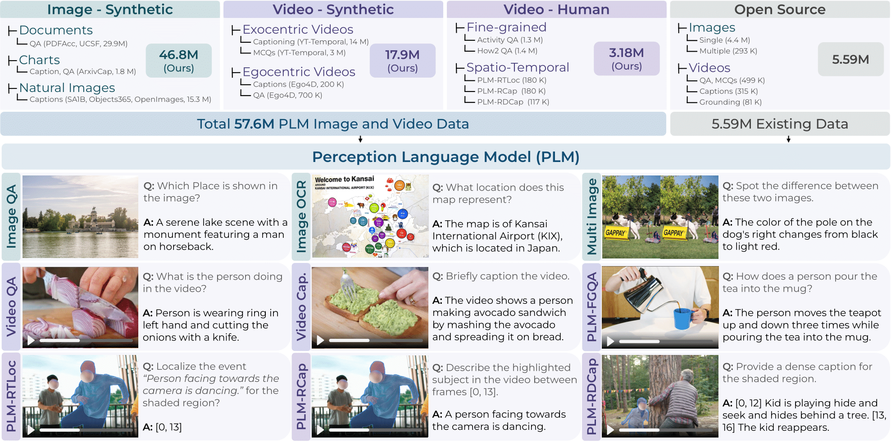

# Perception Language Model (PLM)
[](https://ai.meta.com/research/publications/perceptionlm-open-access-data-and-models-for-detailed-visual-understanding)
[](https://arxiv.org/abs/2504.13180)
[](https://huggingface.co/collections/facebook/perception-lm-67f9783f171948c383ee7498)
[](notebook_demos)
[](../../LICENSE.PLM)

---

This is the official implementation of **Perception Language Model** from our paper:  
**[PerceptionLM: Open-Access Data and Models for Detailed Visual Understanding](https://ai.meta.com/research/publications/perceptionlm-open-access-data-and-models-for-detailed-visual-understanding)**  
Jang Hyun Cho*, Andrea Madotto*, Effrosyni Mavroudi*, Triantafyllos Afouras*, Tushar Nagarajan*, Muhammad Maaz*, Yale Song*, Tengyu Ma*, Shuming Hu*, Suyog Jain, Miguel Martin, Huiyu Wang, Hanoona Rasheed, Peize Sun, Po-Yao Huang, Daniel Bolya, Nikhila Ravi, Shashank Jain, Tammy Stark, Shane Moon, Babak Damavandi, Vivian Lee, Andrew Westbury, Salman Khan, Philipp Krähenbühl, Piotr Dollár, Lorenzo Torresani*, Kristen Grauman*, Christoph Feichtenhofer*  
\* Joint First Author / Project Lead

_[HuggingFace](https://huggingface.co/collections/facebook/perception-lm-67f9783f171948c383ee7498)_ | _[Blog](https://ai.meta.com/blog/meta-fair-updates-perception-localization-reasoning)_ | _[GitHub](https://github.com/facebookresearch/perception_models)_ | _[arXiv](https://arxiv.org/abs/2504.13180)_ | _[BibTeX](#citation)_



PLM consists of a vision encoder with a small scale (<8B parameters) LLM decoder. We start by an analysis of standard training pipelines with available data, without any proprietary model distillation. We investigate large-scale
synthetic data and establish key scaling laws to identify critical data gaps that limit video understanding performance, especially for spatio-temporal reasoning and fine-grained understanding tasks. To fill these gaps, we release 2.8M human-labeled instances of fine-grained video question-answer pairs and spatio-temporally grounded video captions. This release is nearly an order of magnitude larger than the largest existing video datasets. Additionally, we introduce PLM–VideoBench, a suite for evaluating challenging video understanding tasks focusing on the ability to reason about "what", "where", "when", and "how" of a video.


## PLM Resources

| Resource | Description | Documentation |
| --- | --- | --- |
| **Evaluation** | Evaluation of PLM using lmms-eval | [`docs/evaluation.md`](docs/evaluation.md) |
| **Training / Finetuning** | Training and finetuning instructions for PLM | [`docs/training.md`](docs/training.md) |
| **PLM-VideoBench** | Evaluation on PLM-VideoBench using lmms-eval | [`docs/plm_videobench.md`](docs/plm_videobench.md) |
| **End-to-End Finetuning Example** | End-to-end finetuning example on radiology images | [`docs/finetune_example.md`](docs/finetune_example.md) |
| **Generating Response** | Generate responses using a trained model with `generate.py` | [`generate.py`](generate.py) |


> [!TIP]
> To run the following code, download the [`dummy-datasets`](https://dl.fbaipublicfiles.com/plm/dummy_datasets.tar.gz) and extract them to `apps/plm/dummy_datasets`.

```shell
python apps/plm/generate.py \
--ckpt facebook/Perception-LM-3B \
--media_type image \
--media_path apps/plm/dummy_datasets/image/images/14496_0.PNG \
--question 'Describe the bar plot in the image.'

# Expected output
The image presents a bar graph with four distinct categories: step, horror, mood, and lumber. The x-axis lists these categories, while the y-axis is labeled "Values" and ranges from 0 to 10 in increments of 2.
...
...

```

```shell
python apps/plm/generate.py \
--ckpt facebook/Perception-LM-8B \
--media_type video \
--media_path apps/plm/dummy_datasets/video/videos/GUWR5TyiY-M_000012_000022.mp4 \
--question 'What is happening in the video?'

# Expected output
A group of individuals are skipping rope in a coordinated routine on a basketball court. They are standing in a line, with each person holding a rope and performing a synchronized movement, with their arms extended and their bodies in motion. The court has a blue center circle and white lines marking the playing area, and spectators are seated on the sidelines watching the performance.
```

## Tutorials 

For more task-specific usecases, check out our notebook tutorials:
- [Image and video captioning](./notebook_demos/image_and_video_captioning.ipynb) 
- [Image grounding and region captioning](./notebook_demos/image_grounding.ipynb)

## PLM Image Benchmark Results

| Model  | DocVQA | ChartQA | TextVQA | InfoQA | AI2D  | OCRBench | COCO | Nocap | Flickr | MMMU | VQAv2 | OKVQA | VizWiz | MME | SEED | BLINK | CVBench | RealWorldQA | VSR | POPE |
|:---------:|:--------:|:---------:|:---------:|:--------:|:------:|:----------:|:------------:|:-------------:|:--------------:|:------:|:-------:|:--------:|:--------:|:-----:|:------:|:-------:|:----------:|:-------------:|:-----:|:------:|
| PLM1B  | 90.7   | 78.6    | 82.1    | 63.0   | 84.9 | 807      | 138.6      | 124.2       | 100.5        | 34.8 | 81.7  | 61.0   | 59.7   | 1603| 76.3 | 46.8  | 73.8     | 67.1        | 68.8| 88.4 |
| PLM3B  | 93.8   | 84.3    | 84.3    | 74.6   | 90.9 | 830      | 144.9      | 126.5       | 98.0         | 41.2 | 84.3  | 66.8   | 64.0   | 1879| 78.5 | 55.4  | 81.4     | 72.4        | 80.4| 88.7 |
| PLM8B  | 94.6   | 85.5    | 86.5    | 80.9   | 92.7 | 870      | 146.7      | 129.9       | 105.6        | 46.1 | 85.6  | 69.6   | 67.0   | 1989| 79.3 | 56.0  | 81.3     | 75.0        | 82.8| 89.9 |

## PLM Video Benchmark Results

| Model  | VATEX                    | DREAM&nbsp;1K      | How2QA       | MVBench      | NExTQA      | PerceptionTest&nbsp;(test) | STAR       | TVQA       | VideoMME        | TVBench      | ActivityNetQA   | EgoSchema&nbsp;(test) | TemporalBench    | TOMATO     | MotionBench&nbsp;(dev) | TempCompass&nbsp;(MCQ) | CGBench&nbsp;(clue) | Charades&nbsp;STA   | VideoHallucer   | Halluc.&nbsp;EventHallusion |
|:-------------:|:---------------------------:|:-----------------------:|:---------------------:|:-------------:|:-------------:|:--------------------------:|:----------:|:----------:|:----------------:|:-------------:|:--------------------:|:----------------------:|:---------------------:|:------------:|:------------------------:|:-----------------------:|:---------------------:|:-------------------:|:-------------------------------:|:--------------------------------:|
| PLM1B  | 92.5 | 34.3 | 86.4 | 70.1 | 80.3 | 72.7 | 83.7 | 50.3 | 49.2 | 50.4 | 62.5 | 60.4 | 18.2 | 25.5 | 52.2 | 64.6 | 43.6 | 55.2 | 49.2 | 79.5 |
| PLM3B  | 96.1 | 37.4 | 89.4 | 74.7 | 83.4 | 79.3 | 84.8 | 55.3 | 54.9 | 58.9 | 66.2 | 66.9 | 23.4 | 30.9 | 60.4 | 69.3 | 47.2 | 57.7 | 55.5 | 76.5 |
| PLM8B  | 99.7 | 35.9 | 90.7 | 77.1 | 84.1 | 82.7 | 84.9 | 59.3 | 58.3 | 63.5 | 67.3 | 68.8 | 28.3 | 33.2 | 61.4 | 72.7 | 46.4 | 58.6 | 57.7 | 77.3 |

## Citation
```BibTeX
@article{cho2025PerceptionLM,
  title={PerceptionLM: Open-Access Data and Models for Detailed Visual Understanding},
  author={Jang Hyun Cho and Andrea Madotto and Effrosyni Mavroudi and Triantafyllos Afouras and Tushar Nagarajan and Muhammad Maaz and Yale Song and Tengyu Ma and Shuming Hu and Hanoona Rasheed and Peize Sun and Po-Yao Huang and Daniel Bolya and Suyog Jain and Miguel Martin and Huiyu Wang and Nikhila Ravi and Shashank Jain and Temmy Stark and Shane Moon and Babak Damavandi and Vivian Lee and Andrew Westbury and Salman Khan and Philipp Kr\"{a}henb\"{u}hl and Piotr Doll{\'a}r and Lorenzo Torresani and Kristen Grauman and Christoph Feichtenhofer},
  journal={arXiv:2504.13180},
  year={2025}
}

@article{bolya2025PerceptionEncoder,
  title={Perception Encoder: The best visual embeddings are not at the output of the network},
  author={Daniel Bolya and Po-Yao Huang and Peize Sun and Jang Hyun Cho and Andrea Madotto and Chen Wei and Tengyu Ma and Jiale Zhi and Jathushan Rajasegaran and Hanoona Rasheed and Junke Wang and Marco Monteiro and Hu Xu and Shiyu Dong and Nikhila Ravi and Daniel Li and Piotr Doll{\'a}r and Christoph Feichtenhofer},
  journal={arXiv:2504.13181},
  year={2025}
}
```
