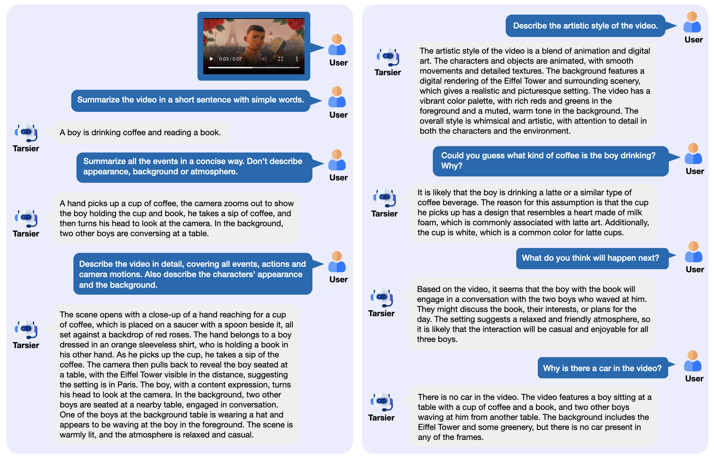

<div align="center">

<h2><a href="https://github.com/bytedance/tarsier/tree/tarsier2">Tarsier2: Advancing Large Vision-Language Models from Detailed Video Description to Comprehensive Video Understanding</a></h2>

Liping Yuan*, Jiawei Wang*, Haomiao Sun*, Yuchen Zhang*, Yuan Lin†

ByteDance Research

*Equally contributed. †Corresponding author.
</div>

<!-- [](https://arxiv.org/abs/2311.17005) -->
[](https://arxiv.org/abs/2501.07888)(Tarsier2)
[](https://arxiv.org/abs/2407.00634)(Tarsier)
[](https://huggingface.co/spaces/omni-research/Tarsier2-7b)
[](https://huggingface.co/omni-research/Tarsier-34b)
[](https://huggingface.co/datasets/omni-research/DREAM-1K)

[](https://paperswithcode.com/sota/video-question-answering-on-mvbench?p=tarsier-recipes-for-training-and-evaluating-1)
[](https://paperswithcode.com/sota/zero-shot-video-question-answer-on-next-qa?p=tarsier-recipes-for-training-and-evaluating-1)
[](https://paperswithcode.com/sota/zero-shot-video-question-answer-on-egoschema-1?p=tarsier-recipes-for-training-and-evaluating-1)
[](https://paperswithcode.com/sota/zeroshot-video-question-answer-on-msvd-qa?p=tarsier-recipes-for-training-and-evaluating-1)
[](https://paperswithcode.com/sota/zeroshot-video-question-answer-on-tgif-qa?p=tarsier-recipes-for-training-and-evaluating-1)
[](https://paperswithcode.com/sota/zeroshot-video-question-answer-on-activitynet?p=tarsier-recipes-for-training-and-evaluating-1)
[](https://paperswithcode.com/sota/zeroshot-video-question-answer-on-msrvtt-qa?p=tarsier-recipes-for-training-and-evaluating-1)


<div align="center">
  <a href="https://github.com/bytedance/tarsier">
    
  </a>
</div>

# Release Notes
- [2025/02/12] 🔥🚀✨ **[Tarsier2-Recap-7B](https://huggingface.co/omni-research/Tarsier2-Recap-7b)** is out! [**Switch to [tarsier2 branch](https://github.com/bytedance/tarsier/tree/tarsier2)**] Tarsier2-Recap-7B is build upon [Qwen2-VL-7B-Instruct](https://huggingface.co/Qwen/Qwen2-VL-7B-Instruct) by distilling the video description capabilities of Tarsier2-7B. Specifically, we finetuned Qwen2-VL-7B-Instruct on [Tarsier2-Recap-585K](https://huggingface.co/datasets/omni-research/Tarsier2-Recap-585K) for 2 epochs with a learning rate of 2e-5. _Tarsier2-Recap-7B shares a similar video captioning ability as Tarsier2-7B, reaching an overall F1 score of 40.7% on [DREAM-1K](https://tarsier-vlm.github.io/), which is only slightly behind Tarsier2-7B (42.0%) and surpasses GPT-4o (39.2%)._

- [2025/01/15] 🔥🚀 **[Tarsier2-Recap-585K](https://huggingface.co/datasets/omni-research/Tarsier2-Recap-585K)** is out! Tarsier2-Recap-585K consists of 585K distinct video clips from open-source datasets (e.g. VATEX, TGIF, LSMDC, etc.) and each one with a detailed video description annotated by Tarsier2-7B. Experiments demonstrate its effectiveness in enhancing the capabilities of existing LVLMs for video description and general video understanding (See Section 4.3 of our [Technical Report](https://arxiv.org/abs/2501.07888)).

- [2025/01/15] 🔥🚀 **[Tarsier2 Technical Report](https://arxiv.org/abs/2501.07888)** is out! We propose Tarsier2-7B(-0115), which sets new state-
of-the-art results across 16 public benchmarks, spanning tasks such as video captioning, video question-answering, video grounding, hallucination test, etc. Tarsier2-7B is comprehensively upgraded in base model ([Qwen2-VL-7B](https://huggingface.co/Qwen/Qwen2-VL-7B-Instruct)) and training data & stage:
  - Pre-train: We scale up the training data to 40M video-text pairs, featuring in both volume and diversity.
  - SFT: Fine-grained temporal alignment is performed during supervised fine-tuning.
  - DPO: Using model-based sampling to automatically construct preference data and applying DPO training for optimization.

<div align="center">
  
  <br>Figure 2: Tarsier2 sets new state-of-the-art on various public benchmarks.
</div>

- [2024/11/05] 🔥🚀 **[Online Demo of Tarsier2-7B-1105](https://huggingface.co/spaces/omni-research/Tarsier2-7b)** is out! We've redesigned our pre-training and post-training processes, using larger, high-quality video-text datasets (see [Tarsier2 Training Data](#Tarsier2-Data)). Tarsier2-7B-1105 generates video descriptions that are significantly more precise than those of Tarsier-34B, rivaling state-of-the-art models like GPT-4o. _In the human side-by-side comparison, Tarsier2-7B-1105 gains a slight advantage (4.8%) over GPT-4o._

- [2024/09/19] 🔥🚀 **[DREAM-1K Leaderboard](https://tarsier-vlm.github.io/)** is out! 20+ latest open-source or closed-source video understanding models are evaluted on the capacity of detailed video description on 1000 video clips of multiple-sources and multi-complexities. Check out the **[DREAM-1K Explorer](https://tarsier-vlm.github.io/explorer.html)** for the video clips and different model results.

- [2024/07/04] 🔥 **Tarsier** is out! We released the model ([Tarsier-7b](https://huggingface.co/omni-research/Tarsier-7b)/[Tarsier-34b](https://huggingface.co/omni-research/Tarsier-34b)), [code](https://github.com/bytedance/tarsier/tree/main), and [data](https://huggingface.co/datasets/omni-research/DREAM-1K) for inference, evaluation and depolyment. Tarsier-34B gains **SOTA** results on 6 open video understanding benchmarks and _comparable capacity of detailed video description to Genmini 1.5 Pro_!

# Perface
Welcome to Tarsier!

In this repository, we introduce Tarsier -- a family of large-scale video-language models, which is designed to generate high-quality video descriptions (see Figure 1), together with good capability of general video understanding (SOTA results on 6 open benchmarks). Tarsier takes a simple model structure (CLIP-ViT + LLM), combined with a carefully designed training strategy: multi-task pre-training (stage-1) and multi-grained instruction tuning (stage-2).

Besides the model, we propose a new video description benchmark called DREAM-1K (<b>D</b>escription
with <b>R</b>ich <b>E</b>vents, <b>A</b>ctions, and <b>M</b>otions), featuring videos from diverse sources and varying complexity. AutoDQ (<b>Auto</b>matic <b>D</b>escription <b>Q</b>uality) is also introduced as a highly interpretable and discriminative approach to evaluate video description quality.

We have released the model, code, and data for inference, evaluation and depolyment. We also provide an online demo for Tarsier2-7B:

- Model:

  | Model      | Link                                                                |
  | -----------|------------------------------------------------------------------------------------------------------------- |
  | Tarsier-7b  | https://huggingface.co/omni-research/Tarsier-7b |
  | Tarsier-34b | https://huggingface.co/omni-research/Tarsier-34b |
  | Tarsier2-Recap-7b | https://huggingface.co/omni-research/Tarsier2-Recap-7b |

- Code: https://github.com/bytedance/tarsier

- Dataset: https://huggingface.co/datasets/omni-research/DREAM-1K

- Demo: https://huggingface.co/spaces/omni-research/Tarsier2-7b

Please <a href="#citeus">cite us</a> if you found our work helpful. 
<div align="center">
  
  <br>Figure 1: Example dialogue between a user and Tarsier. The input video is: <a href="https://github.com/bytedance/tarsier/blob/main/assets/videos/coffee.gif">assets/videos/coffee.gif</a>
</div>

# Overview

### Abstract
<!-- <details> -->
Generating fine-grained video descriptions is a fundamental challenge in video understanding. In this work, we introduce Tarsier, a family of large-scale video-language models designed to generate high-quality video descriptions. Tarsier employs CLIP-ViT to encode frames separately and then uses an LLM to model temporal relationships. Despite its simple architecture, we demonstrate that with a meticulously designed two-stage training procedure, the Tarsier models exhibit substantially stronger video description capabilities than any existing open-source model, showing a +51.4% advantage in human side-by-side evaluation over the strongest model. Additionally, they are comparable to state-of-the-art proprietary models, with a +12.3% advantage
against GPT-4V and a −6.7% disadvantage against Gemini 1.5 Pro. Besides video description, Tarsier proves to be a versatile generalist model, achieving new state-of-the-art results across nine public benchmarks, including multi-choice VQA, open-ended VQA, and zero-shot video captioning. Our second contribution is the introduction of a new benchmark for evaluating video description models, consisting of a new challenging dataset featuring videos from diverse sources and varying complexity, along with an automatic method specifically designed to assess the quality of fine-grained video descriptions. We make our models and evaluation benchmark publicly available at https://github.com/bytedance/tarsier.
<!-- </details> -->

### Simple Model Structure
Tarsier takes a simple sturcture that use a MLP projection layer to connect visual encoder (CLIP ViT) and text decoder (LLM). Frames are encoded independently and concatenated to input into LLM.
<div align="center">
  
  <br>Figure 2: Tarsier Model Structure.
</div>

### Two-stage Training
Tarsier tasks a two-stage training strategy.
- Stage-1: Multi-task Pre-training on 13M data
- Stage-2: Multi-grained Instruction Tuning on 500K data
  
In both stages, we freeze ViT and train all the parameters of projection layer and LLM.

<span id="Tarsier2-Data">**Update for Tarsier2 Training Data**</span>

For Tarsier2, we have increased both the scale and the quality of our training data:
- 26.1M video-text pairs, with 18.7M high-quality in-house data;
- 11.0M image-text pairs, with 1.13M high-quality in-house data;
- 1.11M text instruction tuning data.
<div align="center">
    
  </a>
</div>

### Video Description Evaluation
#### Benchmark: DREAM-1K
We proposed DREAM-1K as a challenging video description benchmark. It contrains a collection of 1,000 video clips with diverse complexities from five different origins: live-action movies, animated movies, stock videos, long YouTube videos, and TikTok-style short videos. We provide a fine-grained manual annotation for each video. See: [data/annotations/DREAM-1k.jsonl](https://github.com/bytedance/tarsier/blob/main/data/annotations/DREAM-1k.jsonl)
<div align="center">
  
  <br>Figure 3: DREAM-1K data Statistics.
</div>

Figure 4 shows the human reference and description results of different models of one video clip ([assets/videos/sitting.mp4](https://github.com/bytedance/tarsier/blob/main/assets/videos/sitting.mp4)) from DREAM-1K.

<div align="center">
  
  <br>Figure 4: Human reference and description results of different models on one video clip from DREAM-1K. This video features six actions, each highlighted in a unique color. Model hallucinations are indicated by underlining and red color.
</div>

#### Evaluation Approach: AutoDQ
We propose AutoDQ as a more interpretable approach to automatic video description evaluation. AutoDQ uses an extraction model to extract events from two video descriptions, then uses an entailment model to examine how many events extracted from one description are entailed by the other description. We use ChatGPT to implement both models, as shown in Figure 5.
<div align="center">
  
  <br>Figure 5: The AutoDQ workflow.</a>
</div>

The relative code is: [evaluation/metrics/evaluate_dream_gpt.py](https://github.com/bytedance/tarsier/blob/main/evaluation/metrics/evaluate_dream_gpt.py)

#### Evaluation Results
We evaluate some advanced open-source video understanding models and two proprietary models (GPT-4V and Genmini 1.5 Pro) on DREAM-1K. The results are shown in Figure 6.
<div align="center">
  
  <br>Figure 6: Evaluation results on DREAM-1K.
</div>

### Video Understanding Benchmarks Evaluation
Tarsier is evluated on 7 commonly used video understanding benchmarks, including MVBench, NeXT-QA, Egoschema, MSVD-QA, MSR-VTT-QA, ActivityNet-QA and TGIF-QA. Ours Tarsier-34b gains 6 SOTA results among the 7 benchmarks.

# Usage
This section provides guidance on how to run, evaluate and deploy Tarsier.
## Setup
Following all are running under the environment of python 3.9. If you are not using python 3.9, you can create a virtual environment with:
```
conda create -n tarsier python=3.9
```
Then run the setup script:
```bash
git clone https://github.com/bytedance/tarsier.git
cd tarsier
git checkout tarsier2

bash setup.sh
```
Note that you should fill in the environment parameters for calling OpenAI Service through Azure, if you need to run evaluations based on ChatGPT (for Open-ended QA and DREAM-1K).

## Model Prepare
Download the model checkpoints from Hugging Face: [Tarsier2-Recap-7b](https://huggingface.co/omni-research/Tarsier2-Recap-7b).

## Quick Start
You can use the following script to run a quick start of video detailed description:

```bash
MODEL_NAME_OR_PATH="path_to_the_model"
VIDEO_FILE="assets/videos/coffee.gif" # Or try your own example, could be images (include gif images), videos.

python3 -m tasks.inference_quick_start \
  --model_name_or_path $MODEL_NAME_OR_PATH \
  --config configs/tarser2_default_config.yaml \
  --instruction "Describe the video in detail." \
  --input_path $VIDEO_FILE
```
The result should be:
```bash
# Model: Tarsier2-Recap-7b
## input_path: assets/videos/coffee.gif
A hand picks up a cup of coffee with a heart-shaped design on the foam from a table surrounded by red roses. The person lifts the cup and takes a sip while holding a book. The person then turns their head to the left, looking towards two other individuals sitting at a table in the background. The two individuals in the background wave and make gestures towards the person drinking coffee. The scene gradually fades out.

## input_path: assets/videos/demo_test.mp4
A man wearing a beanie peeks from behind a tree in a snowy forest, gradually revealing more of his face as he looks ahead. The camera then shows another man carrying a bundle of items walking through the snowy forest. The first man, still behind the tree, quickly draws a gun and aims it at the approaching man. The second man, noticing the gun pointed at him, turns his head to look back.

## input_path: assets/videos/sitting.mp4
A woman is sitting on a wooden floor with a gray exercise mat in front of her, which has a pair of headphones, a smartphone, pink dumbbells, and a glass of orange juice on it. She reaches for the headphones and puts them on. She then picks up the glass of orange juice, opens the lid, and takes a sip. After drinking, she places the glass back on the floor and clasps her hands together.
```


## Benchmark Inference and Evaluation
Here we provide the evaluation examples for Video Caption and Multi-choice VQA.
### Data Prepare
1. Raw Dataset
  - Video Caption: [DREAM-1K](https://tarsier-vlm.github.io/), download from https://huggingface.co/datasets/omni-research/DREAM-1K.

  - Multi-choice VQA: [TVBench](https://paperswithcode.com/sota/video-question-answering-on-tvbench), download from https://huggingface.co/datasets/FunAILab/TVBench.

2. Process to Tarsier2 data format

    We have preprocessed the metadata for Tarsier2, see: [data/annotations](https://github.com/bytedance/tarsier/tree/tarsier2/data/annotations) But you need to change the _"\<placeholder\>"_ in the annotation file to your local video file path according to the _"vid"_. We provide an [example code](https://github.com/bytedance/tarsier/blob/tarsier2/data/fill_in_video_file.ipynb) for processing DREAM-1K and TVBench.

### Benchmark Inference and Evaluation
Following command will firstly run in parallel to inference on the selected benchmarks (Edit the parameters in [scripts/run_inference_benchmark.sh](https://github.com/bytedance/tarsier/blob/tarsier2/scripts/run_inference_benchmark.sh): _"CHUNKS"_ and _"GPULIST"_ to customly control the parallelism), and then run evaluation.
```bash
model_name_or_path="path_to_the_model"
output_dir="tarsier2_predictions"
benchmarks="dream tvbench" # Split benchmarks by space. Default as 'all' to inference on all benchmarks; Also could be task types: ('dream', 'caption', 'mc_qa', 'oe_qa'); Or specific benchmark names: ('dream', 'msvd-caption', 'msr-vtt-caption', 'vatex-caption', 'next-qa', 'egoschema', 'mvbench', 'tvbench', 'video-mme', 'msvd-qa', 'msr-vtt-qa', 'tgif-qa', 'anet-qa')

mkdir $output_dir

bash scripts/run_inference_benchmark.sh $model_name_or_path $output_dir $benchmarks
```
The evaluation results will be printed and saved in _$output_dir_.

The result should be:
```bash
# Model: Tarsier2-Recap-7b
## benchmark: dream
+-------------------------+----------+---------------+------------------+---------+--------+
|           Task          | F1 Score | Action Recall | Action Precision | Success | Failed |
+-------------------------+----------+---------------+------------------+---------+--------+
|  DREAM/movie_animation  |  0.364   |     0.355     |      0.374       |   200   |   0    |
| DREAM/movie_live_action |  0.443   |     0.448     |      0.437       |   200   |   0    |
|   DREAM/vertical_video  |  0.426   |     0.379     |      0.486       |   199   |   1    |
|       DREAM/videvo      |  0.454   |     0.471     |      0.439       |   200   |   0    |
|      DREAM/youtube      |  0.343   |     0.323     |      0.365       |   200   |   0    |
|         OVERALL         |  0.407   |     0.395     |       0.42       |   999   |   1    |
+-------------------------+----------+---------------+------------------+---------+--------+

## benchmark: tvbench
+---------+----------+---------+--------+
|   Task  | Accuracy | Success | Failed |
+---------+----------+---------+--------+
|    AA   |   91.2   |   320   |   0    |
|    AC   |   43.1   |   536   |   0    |
|    AL   |   42.5   |   160   |   0    |
|    AS   |   70.5   |   437   |   0    |
|    ES   |   22.0   |   200   |   0    |
|    MD   |   37.1   |   232   |   0    |
|    OC   |   46.6   |   148   |   0    |
|    OS   |   36.9   |   225   |   0    |
|    ST   |   85.9   |   185   |   0    |
|    UA   |   28.0   |    82   |   0    |
| OVERALL |   54.0   |   2525  |   0    |
+---------+----------+---------+--------+

```

### Evaluation Only
Run the following script to only calcluate the metrics for selected benchmarks.
```bash
pred_dir="dream_predictions"
benchmarks="dream" # Same as above code block

bash run_evaluation_only.sh $pred_dir $benchmark
```
The evaluation result will be saved as: _{pred_dir}/{benchmark-name}\_eval\_result.txt_

## Deployment
### CLI Demo
Use the following script to run a conversation demo in command line.
```bash
model_path="path_to_the_model"

bash scripts/run_demo_cli.sh $model_path
```
Bellow is the input video and a conversation with Tarsier-34b about the video:
<div align="center">
  
  <br>Figure 7: Input video in CLI Demo.</a>
</div>
<br>
<div align="center">
  
  <br>Figure 8: Conversation in CLI Demo.</a>
</div>

### Gradio Demo
Use the following script to run a Gradio Demo.
```bash
model_path="path_to_the_model"

bash scripts/run_demo_gradio.sh $model_path
```

The gradio page show be as following. You shoud input a Video/Image/GIF in according block firstly, and then start conversation. Click the __"Clear"__ button to restart.

<div align="center">
  
  <br>Figure 9: Tarsier Gradio Demo.</a>
</div>

# <span id="citeus">Citation</span>
Pleae cite us as:

```BibTeX
@misc{yuan2025tarsier2advancinglargevisionlanguage,
      title={Tarsier2: Advancing Large Vision-Language Models from Detailed Video Description to Comprehensive Video Understanding}, 
      author={Liping Yuan and Jiawei Wang and Haomiao Sun and Yuchen Zhang and Yuan Lin},
      year={2025},
      eprint={2501.07888},
      archivePrefix={arXiv},
      primaryClass={cs.CV},
      url={https://arxiv.org/abs/2501.07888}, 
}

@misc{wang2024tarsierrecipestrainingevaluating,
      title={Tarsier: Recipes for Training and Evaluating Large Video Description Models}, 
      author={Jiawei Wang and Liping Yuan and Yuchen Zhang and Haomiao Sun},
      year={2024},
      eprint={2407.00634},
      archivePrefix={arXiv},
      primaryClass={cs.CV},
      url={https://arxiv.org/abs/2407.00634}, 
}
```